<div align="center">

# 🏛️ City Governance System

**Enterprise AI Platform for Intelligent Urban Management**

[](https://www.python.org/downloads/)
[](https://fastapi.tiangolo.com/)
[](https://reactjs.org/)
[](https://github.com/langchain-ai/langgraph)
[](https://www.postgresql.org/)
[](https://www.docker.com/)
[](LICENSE)

*Seven AI agents working in harmony to transform municipal operations*

**[Documentation](NAVIGATION_GUIDE.md)** • **[Quick Start](#-quick-start)** • **[API Docs](http://localhost:8000/docs)** • **[Video Demo](VIDEO_SCRIPT.md)**

</div>

---

## 🎯 Overview

A production-ready multi-agent AI system that automates urban management through intelligent cross-departmental coordination. Built with **LangGraph**, **FastAPI**, and **React**, featuring 7 autonomous agents that communicate in real-time to solve complex municipal challenges.

**Real-World Impact:**
```
⚡ Emergency Response: 60% faster    💰 Cost Optimization: 40% improvement
🤝 Coordination Delays: 90% reduction   📊 Decision Transparency: 100% auditability
```

---

## ✨ Key Features

- **🤖 7 AI Agents** - Coordination, Water, Fire, Engineering, Health, Finance, Sanitation
- **🔄 Cross-Department Intelligence** - Agents automatically collaborate (e.g., Health queries Water for contamination data)
- **💬 Natural Language** - Ask questions like "Show areas with water contamination" or "Optimize waste routes"
- **🗄️ 40+ Database Tables** - Complete city operations schema with 450+ sample records
- **🎨 Modern UI** - Interactive dashboard with 3D agent constellation, responsive design
- **🔒 Enterprise Security** - JWT auth, OAuth2, complete audit logging, RBAC

---

## 🏗️ Architecture

```mermaid
graph TB
    User[👤 User] --> Frontend[🎨 React Frontend]
    Frontend --> API[⚡ FastAPI Backend]
    API --> Coordinator[🧠 Coordination Agent]
    
    Coordinator --> Water[💧 Water Agent]
    Coordinator --> Fire[🚒 Fire Agent]
    Coordinator --> Engineering[🏗️ Engineering Agent]
    Coordinator --> Health[🏥 Health Agent]
    Coordinator --> Finance[💰 Finance Agent]
    Coordinator --> Sanitation[🗑️ Sanitation Agent]
    
    Water -.Cross-Agent.-> Health
    
    Water --> DB[(🗄️ PostgreSQL)]
    Fire --> DB
    Engineering --> DB
    Health --> DB
    Finance --> DB
    Sanitation --> DB
    
    style Coordinator fill:#4287f5
    style DB fill:#336791
```



**LangGraph Workflow**: Each agent follows a 6-node pattern: Extract Info → Retrieve Context → Decide Action → Execute Tools → LLM Reasoning → Cross-Coordinate

| Layer | Technologies | Purpose |
|-------|-------------|---------|
| **Frontend** | React 18, Vite, Framer Motion, Three.js | Modern, responsive UI with 3D visualizations |
| **Backend API** | FastAPI, Uvicorn, Pydantic | High-performance async REST API |
| **AI Orchestration** | LangGraph, LangChain | Multi-agent coordination & workflow management |
| **LLM Providers** | Groq (Llama 3.1), OpenAI (GPT-4) | Natural language understanding & generation |
| **Database** | PostgreSQL 16, SQLAlchemy | Relational data storage |
| **Vector DB** | ChromaDB | Semantic search & agent memory |
| **Authentication** | JWT, OAuth2 | Secure user management |
| **Deployment** | Docker, Docker Compose | Containerized microservices |

---

## 🚀 Quick Start

**Prerequisites**: Docker 24+, Docker Compose 2.20+, API Key ([Groq](https://console.groq.com) or OpenAI)

```bash
# 1. Clone repository
git clone https://github.com/yourusername/City-Governance-System.git
cd City-Governance-System

# 2. Configure environment
cp .env.example .env
# Edit .env and add your GROQ_API_KEY or OPENAI_API_KEY

# 3. Start services
docker-compose up -d

# 4. View logs
docker-compose logs -f
   
   # Wait 30-60 seconds for initialization
   ```

4. **Access the Application**
   ```
   🌐 Frontend:  http://localhost
   🔌 Backend:   http://localhost:8000
   📚 API Docs:  http://localhost:8000/docs
   🗃️ Database:  localhost:5432
   ```

5. **Test the System**
   - Navigate to `http://localhost`
   - Click "Launch Dashboard"
   - Login with default credentials (check documentation)
   - Try asking: "What's the status of pipeline inspections?"

### Alternative: Local Development Setup

<details>
<summary>Click to expand local development instructions</summary>

#### Backend Setup
```bash
cd backend

# Create virtual environment
python -m venv venv

# Activate virtual environment
# Windows
.\venv\Scripts\activate
# Linux/Mac
source venv/bin/activate

# Install dependencies
pip install -r requirements.txt

# Set environment variables
export GROQ_API_KEY="your_key"
export DATABASE_HOST="localhost"
export DATABASE_PORT="5432"

# Run database migrations
python -m alembic upgrade head

# Start backend server
python main.py
```

#### Frontend Setup
```bash
cd frontend

# Install dependencies
npm install

# Start development server
npm run dev

# Build for production
npm run build
```

#### Database Setup (Local PostgreSQL)
```bash
# Install PostgreSQL 16
# Create database
createdb departments

# Load schema
psql departments < migrations/complete_schema.sql

# Load sample data
psql departments < migrations/comprehensive_seed_data.sql
```

</details>

---

## 📁 Project Structure

## 📁 Project Structure

```
City-Governance-System/
│
├── 🔙 backend/                     # FastAPI Backend & AI Agents
│   ├── agents/                     # LangGraph Multi-Agent System
│   │   ├── coordination_agent/     # 🧠 Routes requests to departments
│   │   ├── water_agent/            # 💧 Water infrastructure & quality
│   │   ├── fire_agent/             # 🚒 Emergency response & safety
│   │   ├── engineering_agent/      # 🏗️ Infrastructure & projects
│   │   ├── health_agent/           # 🏥 Public health & clinics
│   │   ├── finance_agent/          # 💰 Budgets & financial tracking
│   │   └── sanitation_agent/       # 🗑️ Waste management & recycling
│   │
│   ├── app/                        # FastAPI Application
│   │   ├── routers/                # API route handlers
│   │   ├── models.py               # Pydantic schemas
│   │   ├── database.py             # Database connections
│   │   ├── auth.py                 # Authentication logic
│   │   └── agents_wrapper.py       # Agent integration layer
│   │
│   ├── migrations/                 # Database schemas & migrations
│   ├── scripts/                    # Utility scripts
│   ├── tests/                      # Pytest test suite
│   ├── main.py                     # Application entry point
│   ├── global_config.py            # LLM & app configuration
│   ├── requirements.txt            # Python dependencies
│   └── Dockerfile                  # Backend container image
│
├── 🎨 frontend/                    # React + Vite Frontend
│   ├── src/
│   │   ├── components/             # React components
│   │   │   ├── agents/             # Department-specific pages
│   │   │   ├── Dashboard.jsx       # Main dashboard
│   │   │   ├── Hero.jsx            # Landing page hero
│   │   │   ├── AgentConstellation.jsx  # 3D agent visualization
│   │   │   └── ...
│   │   ├── pages/                  # Route pages
│   │   ├── styles/                 # CSS & Tailwind
│   │   ├── App.jsx                 # React app entry
│   │   └── main.jsx                # Vite entry point
│   │
│   ├── public/                     # Static assets
│   ├── nginx.conf                  # Production server config
│   ├── package.json                # npm dependencies
│   ├── vite.config.js              # Vite configuration
│   ├── tailwind.config.js          # Tailwind CSS config
│   └── Dockerfile                  # Frontend container image
│
├── 🗄️ migrations/                  # Shared Database Files
│   ├── complete_schema.sql         # Full 40+ table schema
│   ├── comprehensive_seed_data.sql # 450+ sample records
│   ├── drop_all_tables.sql         # Clean slate utility
│   └── README.md                   # Migration instructions
│
├── 📝 Documentation/
│   ├── DEPLOYMENT.md               # Production deployment guide
│   ├── NAVIGATION_GUIDE.md         # UI/UX walkthrough
│   ├── SAMPLE_QUERIES.md           # Example AI queries
│   ├── VIDEO_SCRIPT.md             # Demo video script
│   └── VIDEO_STORYBOARD.md         # Visual guide
│
├── 🐳 docker-compose.yml           # Multi-container orchestration
├── .env.example                    # Environment template
├── .gitignore                      # Git ignore rules
├── LICENSE                         # MIT License
└── README.md                       # This file
```

### Key Directories Explained

| Directory | Purpose | Key Files |
|-----------|---------|-----------|
| `backend/agents/` | LangGraph AI agents with 6-node workflows | `graph.py`, `nodes.py`, `tools.py` |
| `backend/app/` | FastAPI routes and business logic | `routers/`, `models.py`, `database.py` |
| `frontend/src/components/` | Reusable React components | `Dashboard.jsx`, `Hero.jsx` |
| `frontend/src/components/agents/` | Department-specific chat interfaces | `WaterAgentPage.jsx`, etc. |
| `migrations/` | SQL schemas and seed data | `complete_schema.sql` |

---

## 🎭 Agent System

### 1. Coordination Agent 🧠

**Role**: Intelligent request router and multi-agent orchestrator

**Capabilities**:
- Analyzes user queries to determine which department(s) to involve
- Maintains conversation context across sessions
- Coordinates complex multi-department scenarios
- Handles escalation when agents need human oversight

**Example Flow**:
```
User: "Schedule pipeline inspection and notify fire department"
→ Coordination Agent analyzes request
→ Routes to Water Agent (pipeline inspection)
→ Routes to Fire Agent (notification)
→ Synthesizes responses into unified answer
```

### 2. Water Agent 💧

**Manages**: Water infrastructure, quality monitoring, consumption tracking

**Data Access**:
- 7 database tables (reservoirs, pipelines, consumption, quality, maintenance, complaints, alerts)
- Real-time sensor data integration
- Historical consumption patterns

**Example Queries**:
```
✅ "What's the status of pipeline inspections?"
✅ "Show water quality reports for this week"
✅ "Which areas have the highest consumption?"
✅ "Schedule maintenance for Zone 3 reservoir"
```

**Tools Available**:
- `get_reservoirs()` - Retrieve reservoir data
- `get_water_quality()` - Quality monitoring results
- `schedule_inspection()` - Create maintenance tasks
- `get_consumption_data()` - Usage analytics

### 3. Fire Agent 🚒

**Manages**: Emergency response, incident tracking, resource allocation

**Data Access**:
- 5 database tables (incidents, stations, vehicles, personnel, equipment)
- Real-time unit availability
- Response time analytics

**Example Queries**:
```
✅ "Show all available fire units"
✅ "What's our average response time this month?"
✅ "Schedule emergency drill for Station 2"
✅ "Generate incident report for last week"
```

**Tools Available**:
- `get_incidents()` - Historical incident data
- `get_station_status()` - Real-time readiness
- `schedule_drill()` - Training coordination
- `get_response_times()` - Performance metrics

### 4. Engineering Agent 🏗️

**Manages**: Infrastructure projects, maintenance scheduling, permit management

**Data Access**:
- 5 database tables (projects, permits, infrastructure, contractors, inspections)
- Project budget tracking
- Contractor performance history

**Example Queries**:
```
✅ "Show active construction projects"
✅ "What maintenance is scheduled for next week?"
✅ "Approve pending permit for Main Street"
✅ "Generate infrastructure status report"
```

**Tools Available**:
- `get_projects()` - Active/completed projects
- `approve_permit()` - Permit workflow
- `schedule_maintenance()` - Infrastructure upkeep
- `get_contractors()` - Vendor management

### 5. Health Agent 🏥

**Manages**: Public health surveillance, facility management, vaccination campaigns

**Data Access**:
- 7 database tables (diseases, facilities, inspections, vaccinations, staff, supplies, alerts)
- Clinic capacity monitoring
- Disease outbreak tracking

**Example Queries**:
```
✅ "How many vaccinations administered this week?"
✅ "Show clinic capacity across all locations"
✅ "Show areas with potential water contamination issues" (queries Water Agent)
✅ "Generate public health report"
```

**Cross-Agent Example**:
```python
# Health Agent automatically queries Water Agent
User → Health Agent: "Show areas with water contamination"
Health Agent → Water Agent: "Get water quality data"
Water Agent → Returns: Quality readings from all stations
Health Agent → User: Analyzes in health context + recommendations
```

### 6. Finance Agent 💰

**Manages**: Budget tracking, expenditure analysis, grant management

**Data Access**:
- 4 database tables (budgets, accounts, grants, reserves)
- Real-time transaction processing
- Multi-year financial forecasting

**Example Queries**:
```
✅ "Show Q1 budget utilization"
✅ "Which departments have pending approvals?"
✅ "Generate financial forecast for next quarter"
✅ "Track grant funding status"
```

**Tools Available**:
- `get_budget_status()` - Real-time utilization
- `approve_payment()` - Financial workflows
- `generate_forecast()` - Predictive analytics
- `track_grants()` - Funding management

### 7. Sanitation Agent 🗑️

**Manages**: Waste collection, route optimization, recycling programs

**Data Access**:
- 3 database tables (routes, complaints, recycling_centers)
- GPS tracking integration
- Environmental impact metrics

**Example Queries**:
```
✅ "Optimize collection routes for District 3"
✅ "Show facility capacity status"
✅ "Report missed collection on Oak Street"
✅ "Generate waste management report"
```

**Tools Available**:
- `optimize_routes()` - AI-powered route planning
- `get_facility_status()` - Capacity monitoring
- `log_complaint()` - Issue tracking
- `get_recycling_stats()` - Environmental metrics

---

## 📚 API Documentation

### REST API Endpoints

**Base URL**: `http://localhost:8000/api/v1`

#### Authentication
```http
POST /auth/register
POST /auth/login
POST /auth/refresh
GET  /auth/me
```

#### Agent Interactions
```http
POST /agent/query
# Body: { "agent": "water", "query": "Show inspections" }

GET  /agent/history/{agent_name}
# Returns conversation history

POST /agent/coordination/multi-department
# Body: { "query": "Complex cross-department request" }
```

#### Department-Specific Endpoints

**Water Department**
```http
GET  /water/reservoirs
GET  /water/quality
GET  /water/consumption
POST /water/inspection
```

**Fire Department**
```http
GET  /fire/incidents
GET  /fire/stations
GET  /fire/vehicles
POST /fire/drill
```

**Engineering Department**
```http
GET  /engineering/projects
GET  /engineering/permits
POST /engineering/approve-permit
GET  /engineering/maintenance
```

**Health Department**
```http
GET  /health/facilities
GET  /health/vaccinations
GET  /health/diseases
POST /health/inspection
```

**Finance Department**
```http
GET  /finance/budget
GET  /finance/transactions
POST /finance/approve-payment
GET  /finance/forecast
```

**Sanitation Department**
```http
GET  /sanitation/routes
POST /sanitation/optimize-route
GET  /sanitation/complaints
POST /sanitation/log-complaint
```

### WebSocket Support (Future)
```http
WS /ws/agent/{agent_name}
# Real-time agent streaming responses
```

### Authentication Headers
```http
Authorization: Bearer <JWT_TOKEN>
Content-Type: application/json
```

### Example Request
```bash
curl -X POST http://localhost:8000/api/v1/agent/query \
  -H "Authorization: Bearer $TOKEN" \
  -H "Content-Type: application/json" \
  -d '{
    "agent": "water",
    "query": "Show all active pipeline inspections"
  }'
```

### Response Format
```json
{
  "success": true,
  "agent": "water",
  "response": "I found 3 active pipeline inspections...",
  "data": {
    "inspections": [...]
  },
  "timestamp": "2024-01-15T10:30:00Z"
}
```

For full API documentation, visit `/docs` (Swagger UI) or `/redoc` (ReDoc) after starting the backend.

---

## 🗄️ Database Schema

### Overview
- **Total Tables**: 40+ across all departments
- **Sample Data**: 450+ realistic records
- **DBMS**: PostgreSQL 16
- **ORM**: SQLAlchemy 2.0.25

### Department Schemas

#### Water Department (7 Tables)
```sql
├── water_reservoirs          # Storage facilities, capacity tracking
├── water_pipelines           # Infrastructure network
├── water_consumption         # Usage records by property
├── water_quality             # Test results (pH, chlorine, etc.)
├── water_maintenance         # Scheduled/completed maintenance
├── water_complaints          # Customer issue tracking
└── water_alerts              # Automated threshold warnings
```

**Key Relationships**:
- `pipelines` → `reservoirs` (source tracking)
- `consumption` → `pipelines` (supply attribution)
- `quality` → `reservoirs` (sample location)

#### Fire Department (5 Tables)
```sql
├── fire_incidents            # Emergency responses, timestamps
├── fire_stations             # Location, capacity, status
├── fire_vehicles             # Apparatus tracking (trucks, ambulances)
├── fire_personnel            # Staffing, certifications
└── fire_equipment            # Inventory management
```

**Key Metrics**:
- Average response time: `AVG(arrival_time - dispatch_time)`
- Unit availability: Real-time status updates

#### Engineering Department (5 Tables)
```sql
├── eng_projects              # Active/completed infrastructure projects
├── eng_permits               # Permit applications & approvals
├── eng_infrastructure        # Asset inventory (roads, bridges)
├── eng_contractors           # Vendor management
└── eng_inspections           # Quality control records
```

**Workflow Support**:
- Permit approval process (pending → approved → completed)
- Project lifecycle tracking

#### Health Department (7 Tables)
```sql
├── health_diseases           # Disease surveillance & outbreaks
├── health_facilities         # Clinics, hospitals, capacity
├── health_inspections        # Restaurant/establishment audits
├── health_vaccinations       # Immunization tracking
├── health_staff              # Personnel certifications
├── health_supplies           # Medical inventory
└── health_alerts             # Public health warnings
```

**Public Health Features**:
- Disease trend analysis
- Vaccination coverage reporting
- Facility capacity planning

#### Finance Department (4 Tables)
```sql
├── finance_budgets           # Departmental allocations
├── finance_accounts          # Account management
├── finance_grants            # External funding tracking
└── finance_reserves          # Emergency funds
```

**Financial Intelligence**:
- Budget utilization percentage
- Grant burn rate calculation
- Multi-year forecasting

#### Sanitation Department (3 Tables)
```sql
├── sanitation_routes         # Collection paths, schedules
├── sanitation_complaints     # Missed pickups, issues
└── sanitation_recycling      # Recycling center operations
```

**Optimization Features**:
- AI-powered route planning (savings: $18,400/year in diesel)
- Environmental impact metrics

#### Shared/System Tables (9+ Tables)
```sql
├── users                     # Authentication & authorization
├── sessions                  # Active user sessions
├── api_logs                  # Request/response audit trail
├── agent_conversations       # LangGraph state persistence
├── notification_preferences  # User alert settings
├── system_config             # Application settings
├── audit_logs                # Compliance tracking
├── feedback                  # User satisfaction ratings
└── scheduled_tasks           # Cron job management
```

### Schema Files
| File | Purpose | Size |
|------|---------|------|
| `complete_schema.sql` | Full 40+ table DDL | ~2500 lines |
| `comprehensive_seed_data.sql` | Sample data (450+ records) | ~1800 lines |
| `drop_all_tables.sql` | Clean slate utility | ~50 lines |

### Initialization
```bash
# Using Docker
docker-compose exec postgres psql -U cityuser -d citydb -f /docker-entrypoint-initdb.d/complete_schema.sql
docker-compose exec postgres psql -U cityuser -d citydb -f /docker-entrypoint-initdb.d/comprehensive_seed_data.sql

# Local PostgreSQL
psql -U cityuser -d citydb -f migrations/complete_schema.sql
psql -U cityuser -d citydb -f migrations/comprehensive_seed_data.sql
```

---

## 🔧 Configuration

### Environment Variables

**LLM Configuration**:
```env
# Choose your LLM provider
GROQ_API_KEY=gsk_xxxxxxxxxxxxx        # Preferred (free tier, fast)
# OPENAI_API_KEY=sk-xxxxxxxxxxxxx     # Alternative

LLM_PROVIDER=groq                     # or "openai"
LLM_MODEL=llama-3.1-70b-versatile     # Groq models: llama-3.1-70b-versatile, mixtral-8x7b-32768
# LLM_MODEL=gpt-4                     # OpenAI models: gpt-4, gpt-3.5-turbo
```

**Database Configuration**:
```env
DATABASE_HOST=postgres                # Use "localhost" for local dev
DATABASE_PORT=5432
DATABASE_NAME=citydb
DATABASE_USER=cityuser
DATABASE_PASSWORD=citypass
DATABASE_SSL_MODE=prefer              # Use "require" in production
```

**Application Settings**:
```env
# Security
JWT_SECRET_KEY=change-this-to-random-64-character-string
JWT_ALGORITHM=HS256
ACCESS_TOKEN_EXPIRE_MINUTES=30

# CORS
CORS_ORIGINS=http://localhost,http://localhost:80

# Environment
NODE_ENV=development                  # or "production"
DEBUG=true                            # Set to false in production
LOG_LEVEL=INFO                        # DEBUG, INFO, WARNING, ERROR
```

### Custom Agent Configuration

Edit `backend/global_config.py` to customize agent behavior:
```python
# LLM Settings
DEFAULT_TEMPERATURE = 0.1              # Lower = more deterministic
DEFAULT_MAX_TOKENS = 2000
DEFAULT_TIMEOUT = 30                   # seconds

# Agent Settings
MAX_ITERATIONS = 10                    # Prevent infinite loops
ENABLE_MEMORY = True                   # Conversation context
CACHE_RESPONSES = True                 # Speed up repeated queries

# Database Settings
CONNECTION_POOL_SIZE = 10
MAX_OVERFLOW = 20
POOL_TIMEOUT = 30
```

---

## 🚀 Quick Start

### Prerequisites
- **Docker** 24.0+ and **Docker Compose** 2.20+
- **API Keys**: Groq (recommended, free tier available) or OpenAI
- **OS**: Windows 10/11, macOS, or Linux
- **RAM**: 4GB+ recommended

### 5-Minute Installation

#### 1️⃣ Clone Repository
```powershell
git clone https://github.com/yourusername/City-Governance-System.git
cd City-Governance-System
```

#### 2️⃣ Configure Environment
```powershell
# Create .env file
Copy-Item .env.example .env

# Edit with your API key (use Notepad or VS Code)
notepad .env
```

**Required Variables**:
```env
# LLM Configuration (choose one)
GROQ_API_KEY=gsk_xxxxxxxxxxxxx        # Preferred (free tier)
# OPENAI_API_KEY=sk-xxxxxxxxxxxxx     # Alternative

# Database (default values work for Docker)
DATABASE_HOST=postgres
DATABASE_PORT=5432
DATABASE_NAME=citydb
DATABASE_USER=cityuser
DATABASE_PASSWORD=citypass

# Security
JWT_SECRET_KEY=change-this-to-random-string-in-production
```

**Get Free Groq API Key**: [https://console.groq.com](https://console.groq.com)

#### 3️⃣ Start Services
```powershell
# Start all services
docker-compose up -d

# Verify services are running
docker-compose ps

# Watch logs (optional)
docker-compose logs -f
```

Expected services:
- ✅ `postgres` (Port 5432) - Database
- ✅ `backend` (Port 8000) - FastAPI
- ✅ `frontend` (Port 80) - React + Nginx

#### 4️⃣ Access Application
Open your browser:
- **🌐 Main App**: [http://localhost](http://localhost)
- **📖 API Docs**: [http://localhost:8000/docs](http://localhost:8000/docs)
- **🔧 ReDoc**: [http://localhost:8000/redoc](http://localhost:8000/redoc)

#### 5️⃣ Test AI Agents
Navigate to any department and try these queries:

**Water Agent** 💧:
```
"Show all reservoir levels"
"What's the water quality status?"
"Schedule inspection for Pipeline 3"
```

**Fire Agent** 🚒:
```
"Show available units"
"What's our response time average?"
"Generate incident report for last week"
```

**Health Agent** 🏥:
```
"Show vaccination statistics"
"Show areas with water contamination issues"  # Cross-agent demo!
"Generate public health report"
```

---

## 🛠️ Development Guide

### Local Backend Development
```powershell
cd backend

# Create virtual environment
python -m venv venv
.\venv\Scripts\activate

# Install dependencies
pip install -r requirements.txt

# Set environment variables
$env:GROQ_API_KEY="your_key"
$env:DATABASE_HOST="localhost"
$env:DATABASE_PORT="5432"
$env:DATABASE_NAME="citydb"

# Run development server
uvicorn main:app --reload --host 0.0.0.0 --port 8000
```

### Local Frontend Development
```powershell
cd frontend

# Install dependencies
npm install

# Start Vite dev server
npm run dev

# Build for production
npm run build

# Preview production build
npm run preview
```

### Running Tests
```powershell
# Full test suite with coverage
docker-compose exec backend pytest --cov=agents --cov=app --cov-report=html

# Specific agent tests
docker-compose exec backend pytest tests/test_water_agent.py
docker-compose exec backend pytest tests/test_health_agent.py

# Integration tests
docker-compose exec backend pytest tests/integration/

# View coverage report
explorer backend/htmlcov/index.html  # Windows
```

### Database Management
```powershell
# Connect to database
docker-compose exec postgres psql -U cityuser -d citydb

# Reset database
docker-compose exec postgres psql -U cityuser -d citydb -f /docker-entrypoint-initdb.d/drop_all_tables.sql
docker-compose exec postgres psql -U cityuser -d citydb -f /docker-entrypoint-initdb.d/complete_schema.sql
docker-compose exec postgres psql -U cityuser -d citydb -f /docker-entrypoint-initdb.d/comprehensive_seed_data.sql

# Backup database
docker-compose exec postgres pg_dump -U cityuser citydb > backup.sql

# Restore backup
docker-compose exec -T postgres psql -U cityuser -d citydb < backup.sql
```

### Debugging
```powershell
# View real-time logs
docker-compose logs -f backend
docker-compose logs -f frontend
docker-compose logs -f postgres

# Inspect container
docker-compose exec backend bash

# Check environment variables
docker-compose exec backend env

# View database connections
docker-compose exec postgres psql -U cityuser -d citydb -c "SELECT * FROM pg_stat_activity;"
```

---

## 🐳 Deployment

### Docker Production Deployment

#### 1️⃣ Build Production Images
```bash
# Build optimized images
docker-compose -f docker-compose.yml build --no-cache

# Tag for registry
docker tag city-governance-backend:latest yourdockerhub/city-gov-backend:v1.0
docker tag city-governance-frontend:latest yourdockerhub/city-gov-frontend:v1.0

# Push to registry
docker push yourdockerhub/city-gov-backend:v1.0
docker push yourdockerhub/city-gov-frontend:v1.0
```

#### 2️⃣ Production Environment
```env
# Production .env settings
NODE_ENV=production
DEBUG=false
CORS_ORIGINS=https://yourdomain.com
JWT_SECRET_KEY=<strong-random-key-here>
DATABASE_SSL_MODE=require
```

#### 3️⃣ Deploy to Server
```bash
# SSH to production server
ssh user@your-server.com

# Pull images
docker-compose pull

# Start services
docker-compose up -d

# Enable auto-restart
docker update --restart=always city-governance-backend
docker update --restart=always city-governance-frontend
docker update --restart=always city-governance-postgres
```

### Cloud Deployment Options

#### AWS Deployment
```bash
# Using AWS ECS/Fargate
# 1. Push images to ECR
aws ecr get-login-password --region us-east-1 | docker login --username AWS --password-stdin <account-id>.dkr.ecr.us-east-1.amazonaws.com
docker tag city-governance-backend:latest <account-id>.dkr.ecr.us-east-1.amazonaws.com/city-gov:backend
docker push <account-id>.dkr.ecr.us-east-1.amazonaws.com/city-gov:backend

# 2. Create ECS task definition (see DEPLOYMENT.md)
# 3. Deploy to ECS cluster
```

#### Railway Deployment
```bash
# Install Railway CLI
npm install -g @railway/cli

# Login and initialize
railway login
railway init

# Set environment variables
railway variables set GROQ_API_KEY=your_key

# Deploy
railway up
```

#### DigitalOcean App Platform
```yaml
# app.yaml
name: city-governance-system
services:
  - name: backend
    github:
      repo: yourusername/City-Governance-System
      branch: main
      deploy_on_push: true
    dockerfile_path: backend/Dockerfile
    envs:
      - key: GROQ_API_KEY
        value: ${GROQ_API_KEY}
  
  - name: frontend
    github:
      repo: yourusername/City-Governance-System
      branch: main
    dockerfile_path: frontend/Dockerfile
    
databases:
  - name: citydb
    engine: PG
    version: "16"
```

### Scaling Considerations
- **Backend**: Horizontal scaling supported (stateless design)
- **Database**: Use managed PostgreSQL (AWS RDS, DigitalOcean Managed DB)
- **Caching**: Add Redis for session management (optional)
- **Load Balancing**: Nginx or cloud-native load balancers
- **Monitoring**: Prometheus + Grafana recommended

For detailed deployment instructions, see [DEPLOYMENT.md](DEPLOYMENT.md).

---

## 🔒 Security

### Authentication & Authorization
- **JWT Tokens**: Secure authentication with configurable expiration
- **Password Hashing**: bcrypt with salt rounds
- **OAuth2**: Support for OAuth2 password flow
- **Role-Based Access**: Admin, Manager, Operator roles

### Data Security
- **SQL Injection Protection**: Parameterized queries via SQLAlchemy
- **Input Validation**: Pydantic schemas for all API inputs
- **CORS Configuration**: Whitelist allowed origins
- **Rate Limiting**: Prevent API abuse (configurable)

### Infrastructure Security
- **HTTPS**: Nginx SSL/TLS termination
- **Docker Non-Root**: Containers run as non-privileged users
- **Environment Variables**: Secrets never committed to git
- **Security Headers**: X-Frame-Options, X-Content-Type-Options, etc.

### Best Practices
```bash
# Generate strong JWT secret
python -c "import secrets; print(secrets.token_urlsafe(64))"

# Rotate API keys regularly
# Use environment-specific .env files
# Enable database SSL in production
# Regular security audits with: pip-audit, npm audit
```

---

## 📈 Performance

### Backend Optimizations
- **Async FastAPI**: Concurrent request handling
- **Database Connection Pooling**: SQLAlchemy pool (10 connections, 20 overflow)
- **LLM Response Caching**: Redis integration (optional)
- **Efficient State Management**: LangGraph optimized workflows

### Frontend Optimizations
- **Code Splitting**: Lazy loading with React.lazy()
- **Video Compression**: H.264/VP9 optimized encoding
- **Static Asset Caching**: Nginx gzip compression + browser caching
- **Three.js Optimization**: Reduced polygon count for 3D effects

### Database Optimizations
- **Indexed Foreign Keys**: Fast joins and lookups
- **Query Optimization**: Analyzed slow queries with EXPLAIN
- **Connection Pooling**: Persistent connections
- **Regular Maintenance**: Automated VACUUM and ANALYZE

### Performance Metrics
- Average API response: <100ms
- LLM inference time: <2s (Groq), <3s (OpenAI)
- Frontend load time: <2s (cold), <500ms (cached)
- Database query time: <50ms (avg)

---
- Connection pooling
- Regular VACUUM and ANALYZE

## 🤝 Contributing

We welcome contributions from the community!

### Development Workflow
1. **Fork the repository**
2. **Create feature branch**: `git checkout -b feature/amazing-feature`
3. **Make changes** and test thoroughly
4. **Commit**: `git commit -m "Add amazing feature"`
5. **Push**: `git push origin feature/amazing-feature`
6. **Open Pull Request** with detailed description

### Contribution Guidelines
- ✅ Follow existing code style (PEP 8 for Python, ESLint for JavaScript)
- ✅ Write tests for new features (`pytest` for backend, `vitest` for frontend)
- ✅ Update documentation (README, docstrings, comments)
- ✅ Ensure all tests pass: `pytest` and `npm test`
- ✅ Keep commits atomic and descriptive
- ✅ Reference issues in commit messages: `Fixes #123`

### Code Style
```python
# Python (PEP 8)
- 4 spaces indentation
- Max line length: 88 characters (Black formatter)
- Type hints encouraged

# JavaScript/React
- 2 spaces indentation
- Use functional components with hooks
- Tailwind CSS for styling
```

### Testing Requirements
- **Backend**: Minimum 80% code coverage
- **Frontend**: Component tests for critical UI
- **Integration**: End-to-end tests for agent workflows

### Reporting Issues
- Use GitHub Issues template
- Provide reproduction steps
- Include environment details (OS, Docker version, etc.)

---

## 📄 License

This project is licensed under the **MIT License** - see [LICENSE](LICENSE) file for details.

```
MIT License

Copyright (c) 2024 City Governance System Contributors

Permission is hereby granted, free of charge, to any person obtaining a copy
of this software and associated documentation files (the "Software"), to deal
in the Software without restriction, including without limitation the rights
to use, copy, modify, merge, publish, distribute, sublicense, and/or sell
copies of the Software, and to permit persons to whom the Software is
furnished to do so, subject to the following conditions:

The above copyright notice and this permission notice shall be included in all
copies or substantial portions of the Software.

THE SOFTWARE IS PROVIDED "AS IS", WITHOUT WARRANTY OF ANY KIND, EXPRESS OR
IMPLIED, INCLUDING BUT NOT LIMITED TO THE WARRANTIES OF MERCHANTABILITY,
FITNESS FOR A PARTICULAR PURPOSE AND NONINFRINGEMENT. IN NO EVENT SHALL THE
AUTHORS OR COPYRIGHT HOLDERS BE LIABLE FOR ANY CLAIM, DAMAGES OR OTHER
LIABILITY, WHETHER IN AN ACTION OF CONTRACT, TORT OR OTHERWISE, ARISING FROM,
OUT OF OR IN CONNECTION WITH THE SOFTWARE OR THE USE OR OTHER DEALINGS IN THE
SOFTWARE.
```

---

## 🆘 Troubleshooting

### Common Issues

#### Backend Won't Start
```powershell
# Check logs
docker-compose logs backend

# Verify API key is set
docker-compose exec backend env | grep GROQ_API_KEY

# Restart backend only
docker-compose restart backend
```

#### Database Connection Failed
```powershell
# Check database status
docker-compose ps postgres

# Test connection
docker-compose exec postgres pg_isready -U cityuser

# View database logs
docker-compose logs postgres

# Reset database
docker-compose down -v
docker-compose up -d
```

#### Frontend Shows 404 Errors
```powershell
# Verify nginx configuration
docker-compose exec frontend cat /etc/nginx/nginx.conf

# Check backend connectivity
curl http://localhost:8000/health

# Rebuild frontend
docker-compose build frontend
docker-compose up -d frontend
```

#### Import Errors in Backend
```powershell
# Verify Python path
docker-compose exec backend python -c "import sys; print(sys.path)"

# Reinstall dependencies
docker-compose exec backend pip install -r requirements.txt

# Check for missing packages
docker-compose exec backend pip list
```

#### Agent Not Responding
```powershell
# Check LLM API connectivity
docker-compose exec backend python -c "import os; print(os.getenv('GROQ_API_KEY'))"

# View agent logs
docker-compose logs backend | grep -i "agent"

# Test direct API call
curl -X POST http://localhost:8000/api/v1/agent/query \
  -H "Content-Type: application/json" \
  -d '{"agent":"water","query":"test"}'
```

#### Port Already in Use
```powershell
# Check what's using port 80
netstat -ano | findstr :80

# Kill process (replace PID)
taskkill /PID <PID> /F

# Or change port in docker-compose.yml
ports:
  - "3000:80"  # Use port 3000 instead
```

For more detailed troubleshooting, see [DEPLOYMENT.md#troubleshooting](DEPLOYMENT.md).

---

## 🙏 Acknowledgments

### Technologies & Frameworks
- **LangGraph** - Multi-agent orchestration framework
- **LangChain** - LLM application framework  
- **FastAPI** - High-performance Python web framework
- **React** - Frontend UI library
- **PostgreSQL** - Reliable relational database
- **Groq** - Ultra-fast LLM inference

### Community
- Thanks to all contributors who help improve this project
- Special thanks to early adopters providing valuable feedback
- Built with inspiration from modern AI agent architectures

---

## 📚 Documentation

### User Guides
- 📖 **[NAVIGATION_GUIDE.md](NAVIGATION_GUIDE.md)** - Complete UI walkthrough
- 💬 **[SAMPLE_QUERIES.md](SAMPLE_QUERIES.md)** - Pre-tested example queries
- 🎬 **[VIDEO_SCRIPT.md](VIDEO_SCRIPT.md)** - 2-minute demo script
- 🎨 **[VIDEO_STORYBOARD.md](VIDEO_STORYBOARD.md)** - Visual production guide
- ⚡ **[QUICKSTART.md](QUICKSTART.md)** - Quick installation guide

### Technical Documentation
- 🚀 **[DEPLOYMENT.md](DEPLOYMENT.md)** - Production deployment guide
- 🧪 **[PHASE3_TESTING_GUIDE.md](PHASE3_TESTING_GUIDE.md)** - Testing strategies
- 📋 **[DEPLOYMENT_CHECKLIST.md](DEPLOYMENT_CHECKLIST.md)** - Pre-launch checklist
- 🏗️ **[STRUCTURE_UPDATE.md](STRUCTURE_UPDATE.md)** - Architecture evolution

### Project History
- ✅ **[PHASE3_FEATURES_COMPLETE.md](PHASE3_FEATURES_COMPLETE.md)** - Feature implementation
- ✨ **[PHASE4_POLISH_COMPLETE.md](PHASE4_POLISH_COMPLETE.md)** - UI/UX refinements
- 📊 **[PROJECT_COMPLETE_SUMMARY.md](PROJECT_COMPLETE_SUMMARY.md)** - Project overview

---

## 🎯 Roadmap

### Phase 5: Advanced Features (Q2 2024)
- [ ] Real-time WebSocket notifications for live updates
- [ ] Advanced analytics dashboard with Plotly/D3.js visualizations
- [ ] Report generation (PDF exports with charts)
- [ ] Multi-language support (i18n)

### Phase 6: Mobile & Integrations (Q3 2024)
- [ ] Mobile app (React Native)
- [ ] SMS/Email notification system
- [ ] Slack/Teams integration for alerts
- [ ] External API integrations (weather, traffic)

### Phase 7: Enterprise Scale (Q4 2024)
- [ ] Kubernetes deployment configurations
- [ ] Advanced caching layer (Redis)
- [ ] Multi-tenant support for multiple cities
- [ ] Role-based access control (RBAC) enhancements
- [ ] Audit logging and compliance features

### Infrastructure Improvements
- [ ] CI/CD pipeline (GitHub Actions)
- [ ] Automated testing pipeline (E2E with Playwright)
- [ ] Performance monitoring (Prometheus + Grafana)
- [ ] Load testing and optimization
- [ ] Disaster recovery procedures

### Community Features
- [ ] Public API documentation portal
- [ ] Plugin system for custom agents
- [ ] Community-contributed agent templates
- [ ] Enhanced developer documentation

---

## 📞 Support & Contact

### Get Help
- **📖 Documentation**: Start with [NAVIGATION_GUIDE.md](NAVIGATION_GUIDE.md)
- **🐛 Bug Reports**: [Open GitHub Issue](https://github.com/yourusername/City-Governance-System/issues)
- **💡 Feature Requests**: [Request Feature](https://github.com/yourusername/City-Governance-System/issues/new?template=feature_request.md)
- **💬 Discussions**: [GitHub Discussions](https://github.com/yourusername/City-Governance-System/discussions)

### Community
- **GitHub Issues**: For bug reports and feature requests
- **Discussions**: Q&A and community support
- **Pull Requests**: Code contributions welcome

### Professional Support
For enterprise deployments, training, or custom development:
- **Email**: your-email@domain.com
- **Website**: https://your-website.com
- **Consulting**: Custom agent development and integration services

---

<div align="center">

### ⭐ Star this repository if you find it useful! ⭐

Built with ❤️ using AI Multi-Agent Architecture

**[Report Bug](https://github.com/yourusername/City-Governance-System/issues)** · 
**[Request Feature](https://github.com/yourusername/City-Governance-System/issues)** · 
**[Documentation](https://github.com/yourusername/City-Governance-System/wiki)**

---

*Transforming municipal operations through intelligent automation*

</div>
